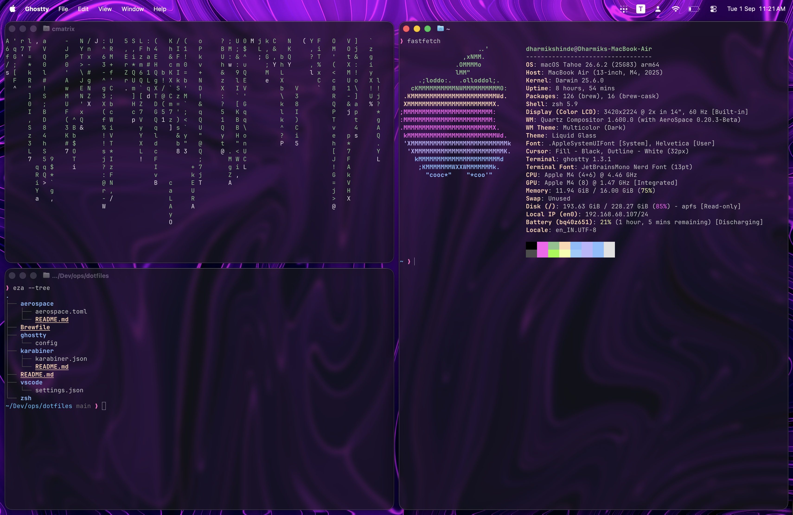

# dmix / dotfiles

Personal macOS dotfiles focused on a keyboard-first workflow, i3-style tiling window management, and zero-friction terminal environments—without disabling System Integrity Protection (SIP).

> **Full Breakdown:** Read the technical design behind this setup at [blog.dharmikshinde.tech/blog/ricing-macos](https://blog.dharmikshinde.tech/blog/ricing-macos).

---

## Stack

- **Window Manager:** [AeroSpace](https://github.com/nikitabobko/AeroSpace) — i3-like tiling (SIP stays enabled)
- **Key Remapper:** [Karabiner-Elements](https://karabiner-elements.pqrs.org/) — Caps Lock Hyper key & modal sublayers
- **Terminal:** [Ghostty](https://ghostty.org/) — GPU-accelerated terminal emulator
- **Shell:** Zsh + [Powerlevel10k](https://github.com/romkatv/powerlevel10k)
- **Editor:** Visual Studio Code — Clean canvas, zero-UI configuration
- **Package Manager:** Homebrew
